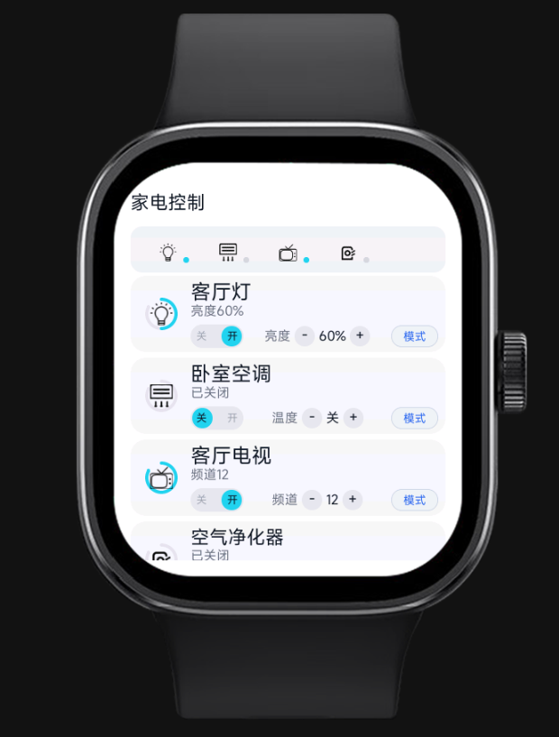

# 佩戴设备家电控制 (Home Control)

## 简介
面向手环/手表的家电控制前端示例，包含单页首页与二级详情页，支持开关、亮度/温度/频道调节。数据为内置假数据，便于界面演示。

## 功能
- 手动控制：开关、亮度/温度/频道加减
- 家庭概览：仅图标与状态点，无文字

## 结构
- 入口与路由：`src/manifest.json`
- 首页：`src/pages/index/index.ux`
- 详情页：`src/pages/detail/detail.ux`
- 全局数据：`src/common/store.js`

## 截图
示例界面请参见项目中的图片与模拟器预览。
