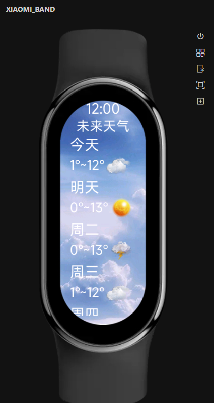

## 项目功能介绍

### 可以上下滑动查看七天内的天气（假数据）

### 页面精美，运行流畅



## 运行环境要求
```
nodejs版本：v18.20.5
```
## 关键实现思路
```
1、首先在整张界面放入背景图片（bg.jpg），并将其置于底层
2、然后加入一个容器放在背景图片上方，并设置一定的透明度
3、在加入的容器内加入两个容器，一个是div容器用来说明界面内容，一个是scroll容器，用来展示天气列表，支持滑动
4、最后调整布局和字体
```
