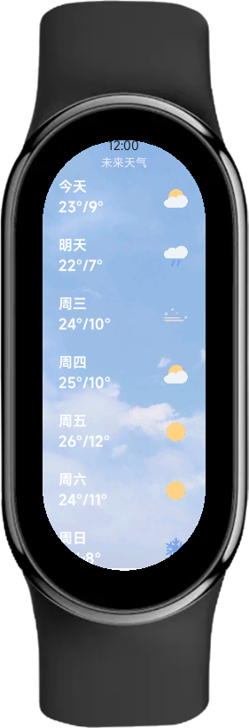
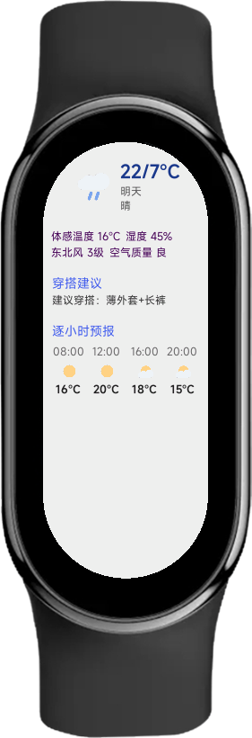

# 小米手环天气预报应用 (Xiaomi Band Weather Forecast App)

## 简介

这是一个为小米手环开发的天气预报应用程序，使用 ALOT IDE 构建。旨在提供简洁直观的未来七日天气信息展示。

## 主要功能

*   **七日天气概览:** 在主屏幕上清晰地展示未来七天的天气预报，包括最高/最低温度和天气状况图标。
*   **每日天气详情:** 用户可以点击任意一天的天气条目，跳转到详情页面，查看该天更详细的天气信息（如湿度、风向风力、穿搭建议、每小时温度等）。

## 当前状态

*   **数据源:** **请注意：** 当前版本使用的是 **内置的模拟数据 (Mock Data)** 进行功能演示和界面开发。显示的并非实时天气。
*   **开发工具:** 使用 ALOT IDE 进行开发和调试。

## 未来计划 / 待办事项

*   **接入和风天气 (HeWeather) API:** 后续计划集成和风天气 API，替换模拟数据，实现真实、动态的天气数据显示。

## 如何安装/运行 (可选，如果需要分享给别人测试)

1.  确保你已安装并配置好 ALOT IDE 开发环境。
2.  克隆或下载此项目代码。
3.  使用 ALOT IDE 打开项目。
4.  按照ALOT IDE要求下载配置文件。
5.  需要建立镜像版本为vela-watch-4.0的模拟器

**主界面:**

**详情界面:**
